# Methodology: Pediatric Cancer Staging with Multi-Agent Architecture

## Overview

This document outlines the methodology behind the Pediatric Cancer Staging Module, which uses a multi-agent architecture powered by CrewAI to automatically analyze medical notes and determine appropriate cancer staging based on the Toronto staging system for pediatric cancers.

## Toronto Staging Data Generation

### Process

The Toronto staging data was generated using a two-phase approach:

1. **Initial Data Extraction (GPT-4.5)**:
   - Large language model GPT-4.5 with "Deep Research" capabilities was used to extract and organize data from the Toronto childhood cancer staging guidelines
   - The prompt instructed the model to create a structured JSON file containing all types of childhood cancer with their staging criteria
   - For each cancer type, the model extracted:
     - Disease name
     - List of criteria used for staging
     - Stage definitions with detailed explanations optimized for LLM understanding
     - Relevant definitions and clarifications

2. **Data Refinement**:
   - The initial JSON file required structural fixes to ensure proper JSON syntax
   - A fixed version of the staging data was created with proper JSON structure while preserving all the original content
   - Finally, the fixed data was consolidated into a single, comprehensive file (`toronoto_staging.json`) containing staging information for 15 different pediatric cancer types

The prompt used for initial data extraction was:
```
openai GPT 4.5 with Deep Research: Read the Toronto childhood cancer staging guidelines and extract an organized json file for all types of childhood cancer with staging criteria listed, starting by disease name, then list of criteria used for staging, then stages with full explanation that are easy for an LLM to understand.
```

## Multi-Agent Architecture

The module employs a multi-agent architecture using the CrewAI framework, where specialized AI agents work together to process medical notes and determine appropriate cancer staging.

### Agent Specialization

The system consists of four specialized agents, each with a specific role in the staging workflow:

1. **Cancer Identifier Agent**
   - **Role**: Pediatric Oncology Specialist
   - **Goal**: Identify the pediatric cancer type and any mentioned EMR stage in medical notes
   - **Responsibility**: Analyze medical notes to determine which cancer type from the Toronto staging system is applicable and extract any existing staging information
   - **Output**: Cancer type and EMR stage (if mentioned)

2. **Criteria Analyzer Agent**
   - **Role**: Cancer Staging Specialist
   - **Goal**: Identify which staging criteria are present in the medical notes for the identified cancer type
   - **Responsibility**: Meticulously analyze medical notes for evidence of each staging criterion relevant to the identified cancer type
   - **Output**: Detailed analysis of which criteria are present, absent, or unknown

3. **Stage Calculator Agent**
   - **Role**: Pediatric Cancer Stage Calculator
   - **Goal**: Calculate the Toronto stage based on identified criteria
   - **Responsibility**: Apply the Toronto staging rules to determine the appropriate stage based on the criteria identified in the previous step
   - **Output**: Calculated stage and explanation of the staging decision

4. **Report Generator Agent**
   - **Role**: Medical Report Specialist
   - **Goal**: Generate clear explanations for cancer staging decisions
   - **Responsibility**: Create a comprehensive report explaining the staging decision and format it for CSV output
   - **Output**: Final CSV-compatible report with file name, EMR stage, calculated stage, and explanation

Each agent uses the OpenAI `gpt-4o-mini` model for inference, with specialized prompting based on their specific role and task.

### Workflow Process

The staging process follows these sequential steps:

1. **Data Loading**:
   - The application loads the Toronto staging data from the JSON file
   - If any JSON syntax errors are encountered, the system attempts to fix them automatically

2. **Medical Note Processing**:
   - The medical note is read from the specified file
   - The note is passed to the Cancer Identifier Agent

3. **Cancer Identification**:
   - The Cancer Identifier Agent analyzes the note to identify the cancer type and any EMR stage
   - This information is passed to the Criteria Analyzer Agent

4. **Criteria Analysis**:
   - The Criteria Analyzer Agent examines the note for specific staging criteria relevant to the identified cancer type
   - The agent produces a detailed analysis of which criteria are present, absent, or unknown
   - This analysis is passed to the Stage Calculator Agent

5. **Stage Calculation**:
   - The Stage Calculator Agent applies the Toronto staging rules to determine the appropriate stage
   - If information is insufficient, the agent indicates this in the output
   - The agent provides an explanation for the staging decision
   - This information is passed to the Report Generator Agent

6. **Report Generation**:
   - The Report Generator Agent creates a final report in CSV-compatible format
   - The report includes the file name, EMR stage, calculated stage, and explanation

7. **Output Writing**:
   - The final report is written to a CSV file
   - The status is updated in `project_status.md`

## Technical Implementation

### CrewAI Integration

The system uses CrewAI to orchestrate the multi-agent workflow. Key components include:

- **Agent Class**: Each agent is instantiated as a CrewAI `Agent` object with specific role, goal, and backstory
- **Task Class**: Tasks are defined using CrewAI's `Task` class, with detailed descriptions and expected outputs
- **Crew Class**: For each step in the workflow, a `Crew` is created with the appropriate agent and task, and then executed

### Error Handling

The system implements robust error handling:

- **JSON Parsing**: The module automatically attempts to fix JSON syntax errors when loading the staging data
- **Missing Data**: If crucial information is missing from medical notes, the Stage Calculator Agent indicates that information is insufficient
- **Process Failures**: Exception handling is implemented throughout the workflow to catch and report errors

### Telemetry Control

The application includes functionality to disable CrewAI's telemetry:

```python
def noop(*args, **kwargs):
    pass

def disable_crewai_telemetry():
    for attr in dir(Telemetry):
        if callable(getattr(Telemetry, attr)) and not attr.startswith("__"):
            setattr(Telemetry, attr, noop)
```

## System Architecture Diagram

```mermaid
flowchart TB
    classDef agentNode fill:#f9d5e5,stroke:#333,stroke-width:2px,color:#333,font-weight:bold
    classDef dataNode fill:#eeeeee,stroke:#333,stroke-width:1px,color:#333
    classDef processNode fill:#d5f9e5,stroke:#333,stroke-width:1px,color:#333
    classDef outputNode fill:#d5e5f9,stroke:#333,stroke-width:1px,color:#333

    %% Input Data
    InputMedicalNote[["📋 Medical Note\n(example.txt)"]]:::dataNode
    StagingData[["📊 Toronto Staging Data\n(toronoto_staging.json)"]]:::dataNode
    
    %% User Initiating Process
    User["👤 User\nruns script"]:::processNode
    
    %% Main Module
    PediatricCancerStaging["🏥 PediatricCancerStaging\nModule"]:::processNode
    
    %% The Agents
    AgentIdentifier["🔍 Cancer Identifier Agent\n(Pediatric Oncology Specialist)"]:::agentNode
    AgentCriteria["📋 Criteria Analyzer Agent\n(Cancer Staging Specialist)"]:::agentNode
    AgentCalculator["🧮 Stage Calculator Agent\n(Pediatric Cancer Stage Calculator)"]:::agentNode
    AgentReport["📝 Report Generator Agent\n(Medical Report Specialist)"]:::agentNode
    
    %% Process Steps
    ProcessIdentify["Identify Cancer Type & EMR Stage"]:::processNode
    ProcessAnalyze["Analyze Staging Criteria"]:::processNode
    ProcessCalculate["Calculate Toronto Stage"]:::processNode
    ProcessReport["Generate Final Report"]:::processNode
    
    %% Intermediate Data
    DataCancerType["🏷️ Cancer Type &\nEMR Stage"]:::dataNode
    DataCriteriaAnalysis["📊 Criteria Analysis"]:::dataNode
    DataStageCalculation["🎯 Calculated Stage &\nExplanation"]:::dataNode
    
    %% Final Output
    OutputCSV[["📄 Results CSV\n(results.csv)"]]:::outputNode
    
    %% Connections/Flow
    User --> PediatricCancerStaging
    InputMedicalNote --> PediatricCancerStaging
    StagingData --> PediatricCancerStaging
    
    PediatricCancerStaging --> AgentIdentifier
    AgentIdentifier --> ProcessIdentify
    InputMedicalNote --> ProcessIdentify
    StagingData --> ProcessIdentify
    ProcessIdentify --> DataCancerType
    
    DataCancerType --> ProcessAnalyze
    InputMedicalNote --> ProcessAnalyze
    StagingData --> ProcessAnalyze
    AgentCriteria --> ProcessAnalyze
    ProcessAnalyze --> DataCriteriaAnalysis
    
    DataCancerType --> ProcessCalculate
    DataCriteriaAnalysis --> ProcessCalculate
    InputMedicalNote --> ProcessCalculate
    StagingData --> ProcessCalculate
    AgentCalculator --> ProcessCalculate
    ProcessCalculate --> DataStageCalculation
    
    DataCancerType --> ProcessReport
    DataCriteriaAnalysis --> ProcessReport
    DataStageCalculation --> ProcessReport
    AgentReport --> ProcessReport
    ProcessReport --> OutputCSV
    
    %% Subgraph for CrewAI Framework
    subgraph CrewAI ["🤖 CrewAI Framework"]
        AgentIdentifier
        AgentCriteria
        AgentCalculator
        AgentReport
    end
    
    %% Subgraph for Data Flow
    subgraph ProcessFlow ["🔄 Processing Flow"]
        ProcessIdentify --> ProcessAnalyze --> ProcessCalculate --> ProcessReport
    end
```



## Conclusion

The Pediatric Cancer Staging Module demonstrates the power of multi-agent architectures for complex medical tasks. By breaking down the staging process into specialized agents with distinct responsibilities, the system can process medical notes comprehensively and produce accurate staging information based on the Toronto staging system.

The approach showcases how large language models can be effectively integrated into clinical workflows to assist with complex decision-making tasks, while maintaining a clear explanation of the reasoning process. 